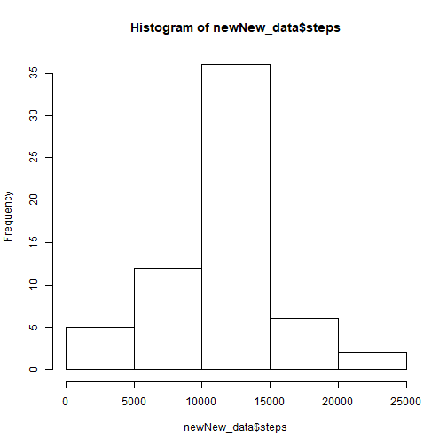

Course Project 1
=================
##Load and process the data
- Step 1a: Load the packages

```r
library(dplyr)
```

```
## 
## Attaching package: 'dplyr'
```

```
## The following objects are masked from 'package:stats':
## 
##     filter, lag
```

```
## The following objects are masked from 'package:base':
## 
##     intersect, setdiff, setequal, union
```

```r
library(lubridate)
```

```
## Warning: package 'lubridate' was built under R version 3.5.3
```

```
## 
## Attaching package: 'lubridate'
```

```
## The following object is masked from 'package:base':
## 
##     date
```

```r
library(ggplot2)
```
- Step 1b: Load the data

```r
df <- read.csv("activity.csv",header=TRUE)
```
- Step 2: Clean the data

```r
df$date <- ymd(df$date)
```
##What is the mean total number of steps taken per day?

- Step 1: Calculate the total number of steps taken per day


```r
data <- df%>%
    filter(!is.na(steps))%>%
    group_by(date)%>%
    summarize(steps=sum(steps))%>%
    print
```

```
## # A tibble: 53 x 2
##    date       steps
##    <date>     <int>
##  1 2012-10-02   126
##  2 2012-10-03 11352
##  3 2012-10-04 12116
##  4 2012-10-05 13294
##  5 2012-10-06 15420
##  6 2012-10-07 11015
##  7 2012-10-09 12811
##  8 2012-10-10  9900
##  9 2012-10-11 10304
## 10 2012-10-12 17382
## # ... with 43 more rows
```

- Step 2: Plot a histogram of the total number of steps taken each day


```r
hist(data$steps)
```


- Step 3: Calculate the mean and media


```r
mean<-mean(data$steps,na.rm=TRUE)
mean
```

```
## [1] 10766.19
```

```r
median<-median(data$steps,na.rm=TRUE)
median
```

```
## [1] 10765
```

##What is the average daily activity pattern?
 
- Step 1: Time series plot of the 5-minute interval and average number of steps taken across all days


```r
timeseries <- df%>%
    filter(!is.na(steps))%>%
    group_by(interval)%>%
    summarize(steps=mean(steps))
plot(x=timeseries$interval,y=timeseries$steps,type="l")
```


- Step 2: What is the maximum interval?

```r
maximum<-timeseries[which(timeseries$steps==max(timeseries$steps)),]
maximum$interval
```

```
## [1] 835
```

##Finding missing values

- Step 1: Report the total number of missing values in the dataset


```r
#na_set <- is.na(df$steps)
#count(na_set)
```

- Step 2&3: Fill in missing values & create new dataset with the values filled in

```r
new_df <- df
na_set <- is.na(new_df$steps)
averageSteps <- tapply(new_df$steps,new_df$interval,mean,na.rm=TRUE,simplify=TRUE)
new_df$steps[na_set]<-averageSteps[as.character(new_df$interval[na_set])]
```

- Step 4: Count the number of steps

```r
newNew_data <- new_df%>%
    group_by(date)%>%
    summarize(steps=sum(steps))%>%
    print
```

```
## # A tibble: 61 x 2
##    date        steps
##    <date>      <dbl>
##  1 2012-10-01 10766.
##  2 2012-10-02   126 
##  3 2012-10-03 11352 
##  4 2012-10-04 12116 
##  5 2012-10-05 13294 
##  6 2012-10-06 15420 
##  7 2012-10-07 11015 
##  8 2012-10-08 10766.
##  9 2012-10-09 12811 
## 10 2012-10-10  9900 
## # ... with 51 more rows
```

- Step 5: Create a histogram and calculate the mean and median of steps for the new dataset


```r
hist(newNew_data$steps)
```



```r
new_mean<-mean(newNew_data$steps)
new_mean
```

```
## [1] 10766.19
```

```r
new_median<-median(newNew_data$steps)
new_median
```

```
## [1] 10766.19
```

##Are there differences in activity patterns between weekdays and weekends?

- Step 1: Create a factor variable for weekday/weekend


```r
new_df <- mutate(new_df, typeday = ifelse(weekdays(new_df$date) == "Saturday" | weekdays(new_df$date) == "Sunday", "weekend", "weekday"))
new_df$typeday <- as.factor(new_df$typeday)
head(new_df)
```

```
##       steps       date interval typeday
## 1 1.7169811 2012-10-01        0 weekday
## 2 0.3396226 2012-10-01        5 weekday
## 3 0.1320755 2012-10-01       10 weekday
## 4 0.1509434 2012-10-01       15 weekday
## 5 0.0754717 2012-10-01       20 weekday
## 6 2.0943396 2012-10-01       25 weekday
```

- Step 2: Plot the difference between weekday and weekend 5-minute interval averages


```r
fivemin<-new_df%>%
    group_by(interval,typeday)%>%
    summarize(steps=mean(steps))

s <- ggplot(fivemin, aes(x=interval, y=steps, color = typeday)) +
  geom_line() +
  facet_wrap(~typeday, ncol = 1, nrow=2)
print(s)
```


